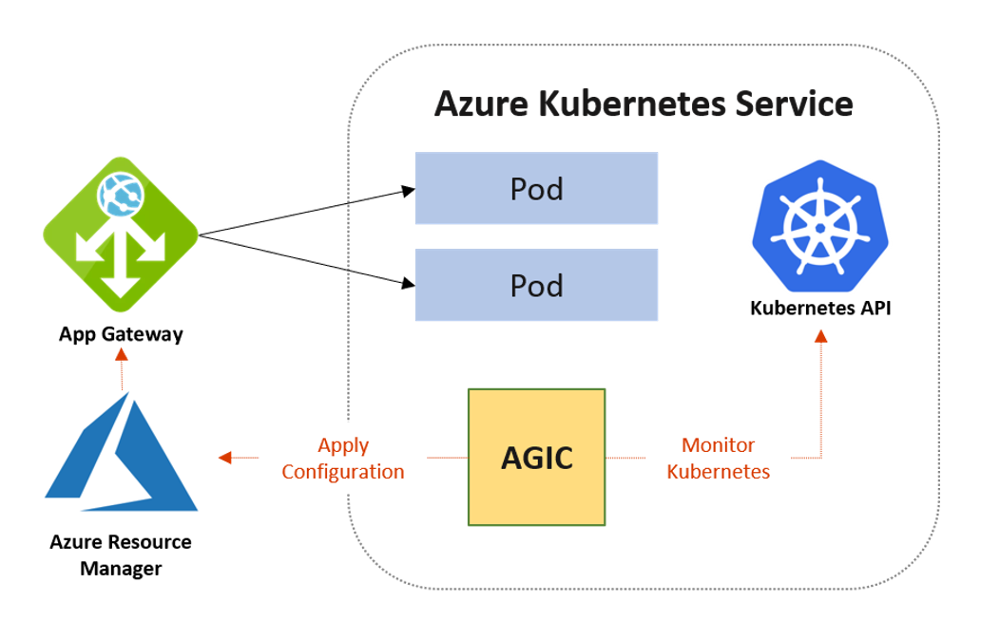
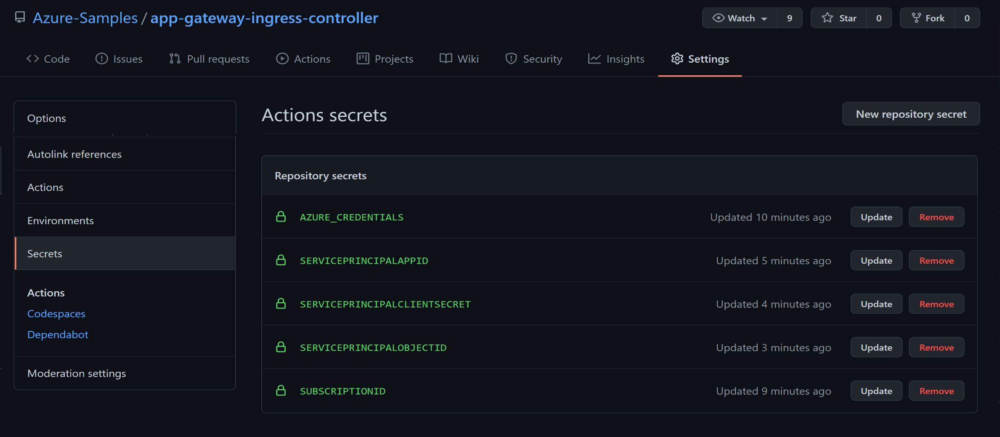
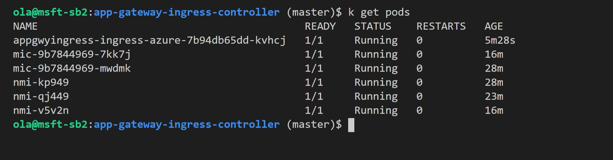
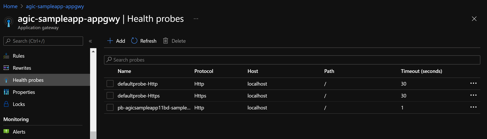
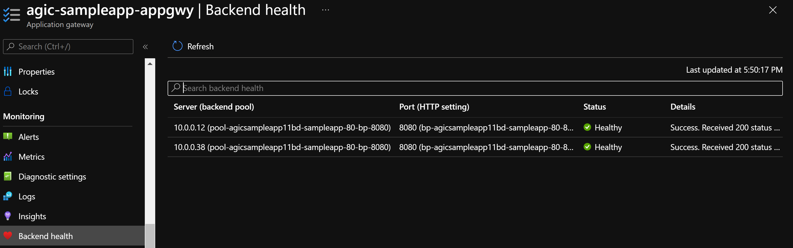
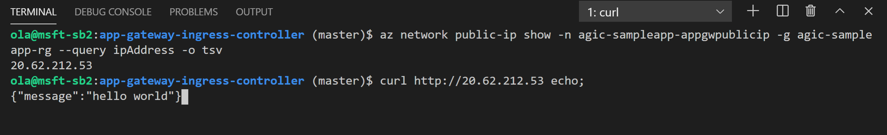

# Using Application Gateway Ingress Controller (AGIC) with Azure Kubernetes

## Overview

This repo is a walkthrough to simplify the deployment of a greenfield [App Gateway Ingress Controller](https://docs.microsoft.com/en-us/azure/application-gateway/ingress-controller-install-new) using an automated Github Actions workflow. 


Application Gateway Ingress Controller setup helps eliminate the need to have another load balancer/public IP in front of AKS cluster and avoids multiple requests to reach the AKS cluster. Application Gateway talks to pods directly using their private IP and does not require NodePort or KubeProxy services thus improves performance.



AGIC currently uses the Standard_v2 and WAF_v2 SKUs, and provide benefits such as; URL routing, Cookie-based affinity, Secure Sockets Layer (SSL) termination, End-to-end SSL, Support for public, private, and hybrid web sites, and Integrated web application firewall. AGIC is configured via the Kubernetes Ingress resource, along with Service and Deployments/Pods. Here is an example of an AGIC configured Kubernetes Ingress resource:

```yaml
apiVersion: networking.k8s.io/v1
kind: Ingress
metadata:
  name: agic-sample-app
  labels: agic-sample-app
  annotations:
    kubernetes.io/ingress.class: azure/application-gateway
spec:
  rules:
  - http:
      paths:
        - path: /
          pathType: Prefix
          backend:
            service:
              name: agic-sample-app
              port:
                number: 80
```

In this repo you can find a containerized Python "hello world" sample app (deployed with [helm](https://helm.sh/)) running in an AKS cluster inside a network infrastructure with vNet, public IP, Subnets, App Gateway, and Managed Identity (provisioned with ARM templates). All the setup in the Github Actions workflow can be found [here](.github\workflows\devops-workflow.yml). The steps includes:

- Provision vNet, Public IP, Subnet, App Gateway, Managed Identity, App Insights, and an AKS Cluster.
- Install the [AAD Pod Identity & Kubernetes CRDs](https://docs.microsoft.com/en-us/azure/aks/use-azure-ad-pod-identity) using `kubectl`.
- Install [Application Gateway Ingress Controller ](https://docs.microsoft.com/en-us/azure/application-gateway/ingress-controller-overview) using `helm`.
- Deploy a containerized sample Python "Hello message" app to the AKS cluster using `helm`.

The AGIC Kubernetes Ingress resource's helm template can be found [here](.\Application\charts\sampleapp\templates\ingress.yaml).

Folder structure:

- `.github\workflows`
  - `devops-workflow.yml` - Github Actions Pipelines yaml file
- `Application`
  - `charts`
    - `sampleapp` - Helm chart for sample app
  - `fastapi-app` - Python sample app
  - `dockerfile` - Dockerfile for the sample app
- `ArmTemplates` - Arm Templates for provisioning vnet, subnet, public ip, aks, acr and application insights

## Getting Started

### Prerequisites

- [Azure CLI](https://docs.microsoft.com/en-us/cli/azure/install-azure-cli?view=azure-cli-latest): Create and manage Azure resources.
- [Kubectl](https://kubernetes.io/docs/tasks/tools/install-kubectl/): Kubernetes command-line tool which allows you to run commands against Kubernetes clusters.
- [GitHub](https://github.com/) account

### Set Up

1. Fork the repo to your Github Account and git clone.
2. Create a Service Principal with 'User Access Adminstrator' role for aks to manage and access network resources and assign a 'Contributor' role with Subscription scope.

    ```bash
    # Set your variables
    SERVICEPRINCIPALNAME="agic-sampleapp-spn"
    SUBSCRIPTIONID="xxxxxxxx-xxxx-xxxx-xxxx-xxxxxxxxxxxx"

    # Create a Service Principal with User Access Adminstrator role
    az ad sp create-for-rbac --name http://$SERVICEPRINCIPALNAME --role 'User Access Administrator' --output json

    # Assign a Contributor role to the Service Principle with Subscription scope 
    AppID=$(az ad sp show --id http://$SERVICEPRINCIPALNAME --query appId --output tsv)
    az role assignment create --assignee $AppID --role Contributor --scope /subscriptions/$SUBSCRIPTIONID
    ```

3. Use the JSON output of the last command as a secret named `AZURE_CREDENTIALS` in the Github repository settings ( Settings -> Secrets -> Add New Secret ).
    ```json
      {
        "clientId": "<GUID>",
        "clientSecret": "<GUID>",
        "subscriptionId": "<GUID>",
        "tenantId": "<GUID>"
      }
    ```

    Also add a secret named `SUBSCRIPTIONID` for the subscription id, `SERVICEPRINCIPALOBJECTID` for the Service Principle object id, `SERVICEPRINCIPALCLIENTSECRET` for the Service Principle client secret, and `SERVICEPRINCIPALAPPID` for the Service Principle app id. 
    
    

    **Note:** The Service Principle clientId and clientSecret is in the JSON output as 'appId' and 'password' respectively. The object id can be obtained as below:

    ```bash
    AppID=$(az ad sp show --id http://$SERVICEPRINCIPALNAME --query appId --output tsv)
    ObjectID=$(az ad sp show --id $AppID --query objectId -o tsv)

    # Output the Service principle Object Id
    echo "Service Principle Object ID: $ObjectID"
    ```

    For more details on generating the deployment credentials please see [this guide](https://docs.microsoft.com/en-us/azure/azure-resource-manager/templates/deploy-github-actions#generate-deployment-credentials).


4. [Github Actions](https://docs.github.com/en/actions) will be used to automate the workflow and deploy all the necessary resources to Azure. Open the [.github\workflows\devops-workflow.yml](.github\workflows\devops-workflow.yml) and change the environment variables such as the `RESOURCEGROUPNAME`, `KUBERNETESSUBNETNAME`, `CLUSTERNAME`, `APPGATEWAYSUBNETNAME`, `VNETNAME`, `APPGWYNAME` e.t.c accordingly.

5. Commit your changes. The commit should trigger the jobs within the workflow and provision all the resources.

## Validate the Results

1. When the deployment is successful, all the Kubernetes components should be in a running state:

    ```bash
    # Connect to the AKS Cluster
    az aks get-credentials -n $CLUSTERNAME -g $RESOURCEGROUPNAME 

    # Get pods
    kubectl get pods
    ```
    

2. Login to [Azure Portal](https://portal.azure.com) to check the application gateway frontend and backend health probes shows up and healthy respectively.

    

    

3. Get the Public IP Address of the Aplication Gateway and curl the IP Address:

    ```bash
    # #Get the ip address of the app gateway
    az network public-ip show -n $APPGWYPUBIPNAME -g $RESOURCEGROUPNAME --query ipAddress -o tsv
    ```
    
    

